User's Guide
============

Overview
--------

For now, please look at :ref:`Introduction`.

Features
--------

Walkthrough
-----------

*Note that the numbers shown in the screenshots are not accurate to the
latest version of the prototype, which fixes problems with the 
probability calculation.*

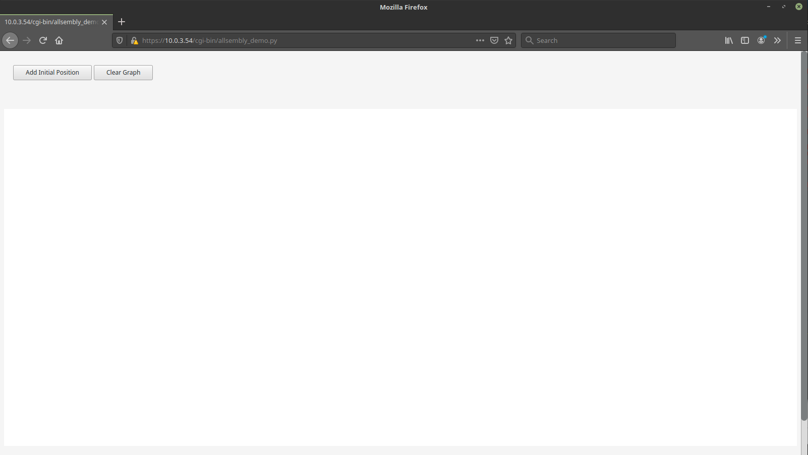

Click the button "Add Initial Position" to get started.

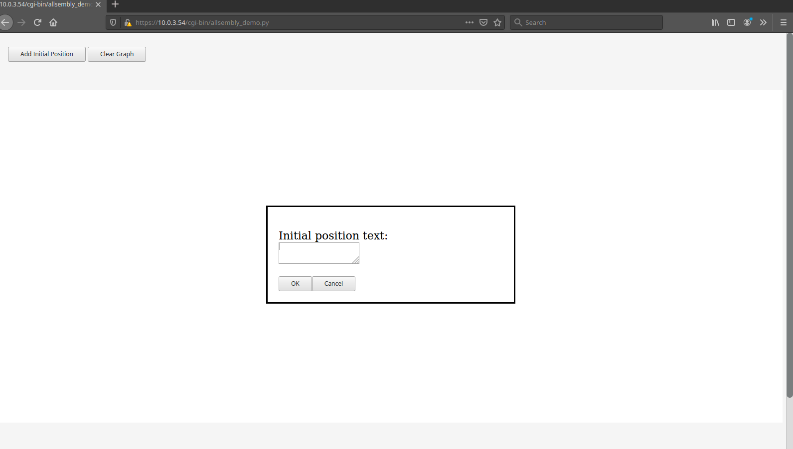

An initial position is a position that is being taken, which is expected
to be the conclusion under consideration.  Enter the text of the 
position being taken, then press "OK".

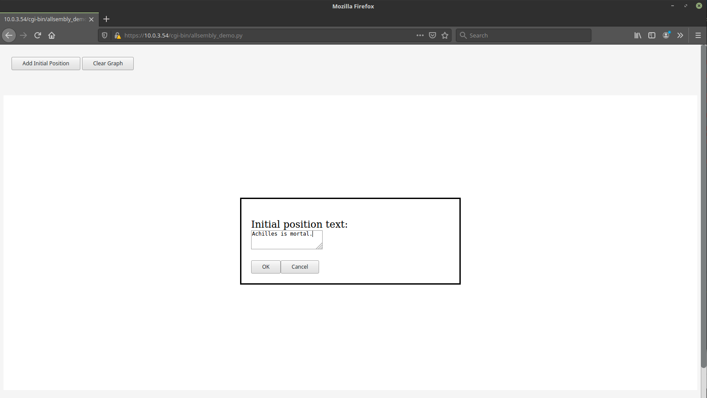

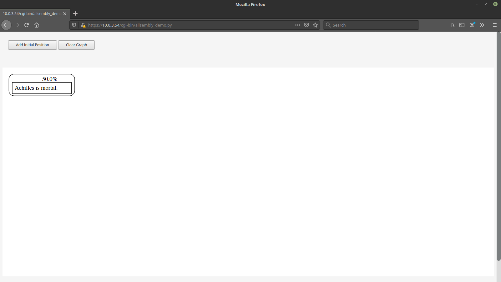

The position appears in the diagram.  It is annotated above with
50.0% because there is no information pro or con to influence the estimate
of the probability of the position being true or correct.  Fifty percent
means indifference between true and false, correct and incorrect.

The diagram may be moved around by clicking and dragging it with the mouse
and zooming in and out may be accomplished with a mouse scroll wheel.
Additional controls for panning and zooming are intended for a future version.
Currently, the panning is a bit buggy.  If the diagram disappears from view, 
you can get it back by loading the page again.  Just press enter in the
location line after the URL.  (Do not use the browser's reload or refresh
button since that would cause the last form to be resubmitted.)

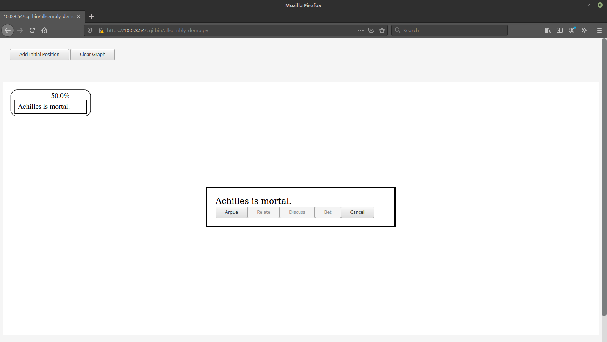

Clicking on a position opens the position detail dialog box.
Currently this only contains the full text of the position and
buttons showing the actions that may be taken with respect to the
position.  The only action available in this version is "Argue",
which means to present a pro or con consideration or piece of
evidence supporting or opposing the position.

The greyed out buttons are actions that will be available in future
revisions of the software.  "Define" means to clear up the meanings of
terms in the position.  "Discuss" means to start or add to an informal
discussion about the position.  Discussions are expected to be useful
for coming up with good arguments or good definitions of terms.  "Bet"
means to place a bet on whether the weight of evidence will support
the position in the end (i.e., whether pro considerations will outweigh con 
considerations).
"Relate" means to propose that the positon is related to some other
position by being either the same as the other position or mutually
exclusive with it.  This will enable the computer to model dependencies 
between positions so as not to over or under count their weights in the
probability estimate.

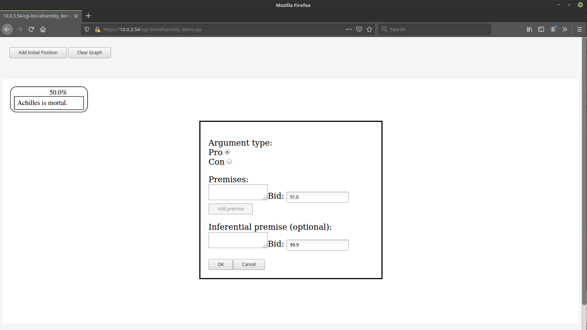

Pressing the "Argue" button opens the argue dialog box.  Premises are
the reasons or evidence you are contributing that supports or opposes
the position.  It is supposed to support the position when the 
selected "Argument type" is "Pro" and to oppose the position when the
selected "Argument type" is "Con".  Premises are themselves new positions.
When adding a premise, it is mandatory to give one's estimate of the 
probability of the truth or correctness of the premise in the form of
a bid.  A bid is an offer to buy a betting contract.  In a future
version of this software, bid orders will be filled when there is a
corresponding order pending at or below your bid price.

Currently, there is no interaction with other users in the software.
The system will accept whatever bid you put in.  So you can simulate
the case of a position stabilizing at a particular price.

After filling the fields, click "OK" to add your pro or con position
to the diagram.

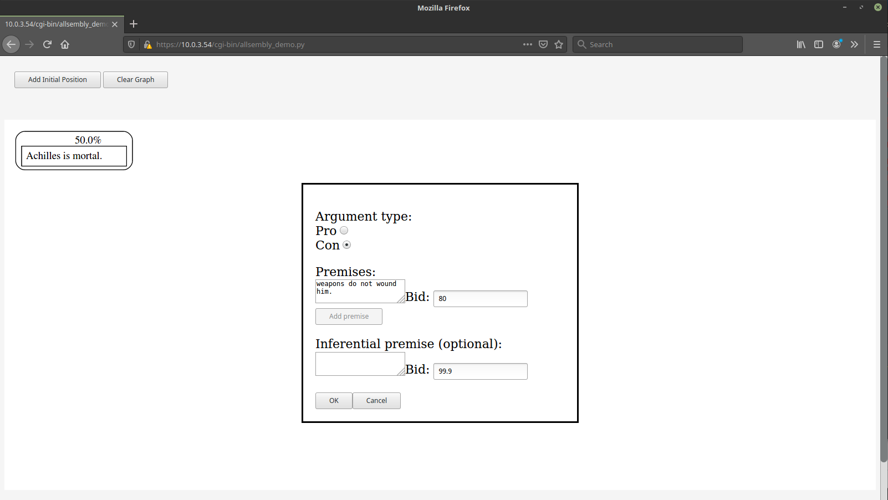

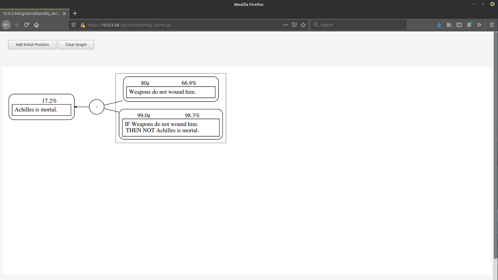

The computer updates the probability estimates based on the prices of
the positions pro and con.  Since a "con" position was added, there is
only evidence against the position that "Achilles is mortal", namely
that "Weapons do not wound him."  Prices are between 0 and 100 "cents".
A high price like 80 "cents" indicates high confidence in a position
among those who have bid.  High confidence in a "con" position lowers
the probability of the position it opposes.

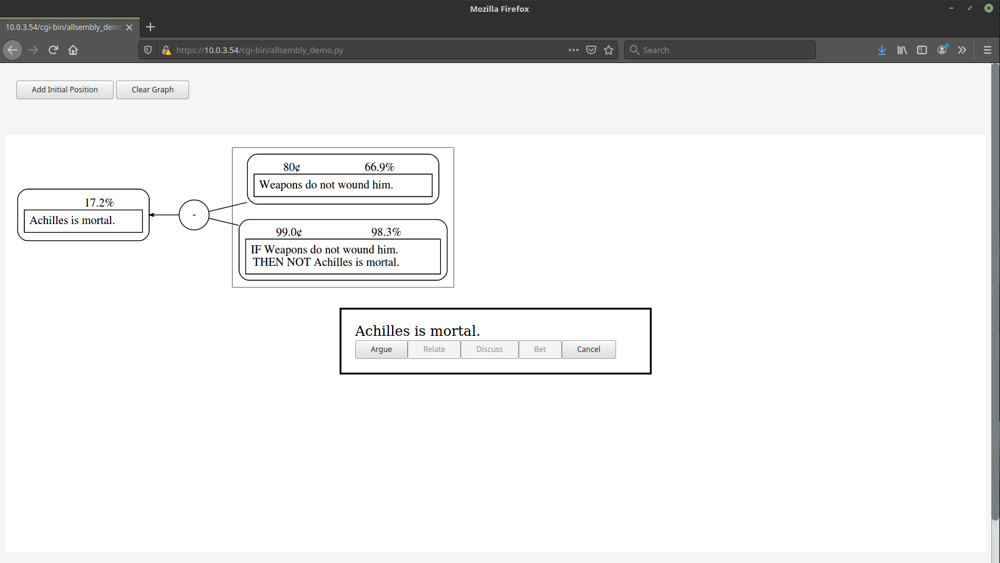

A new pro or con consideration may be added by clicking on the position
again.

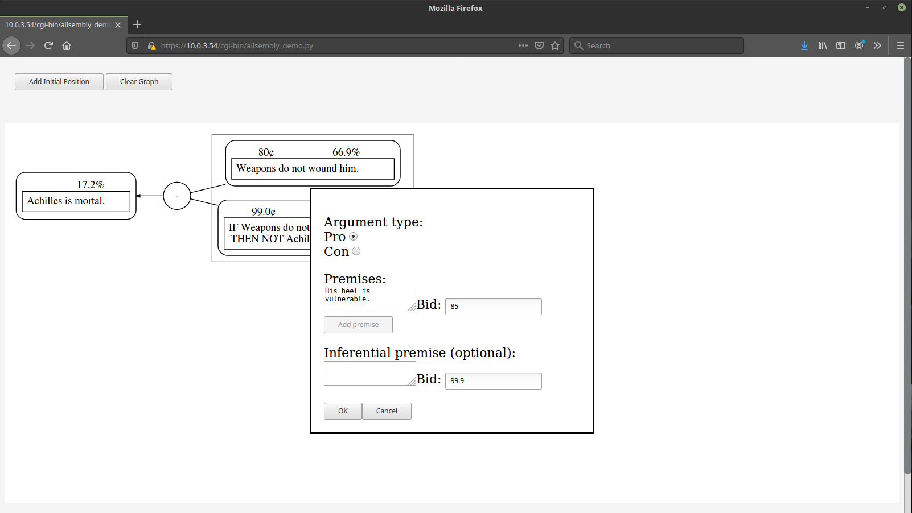

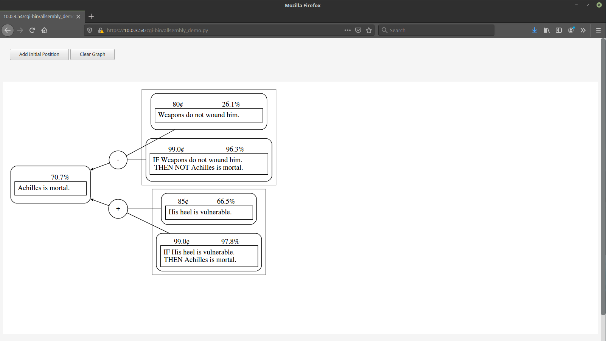

A "pro" consideration has been added and the probability estimate is updated
by the computer software.  There is greater confidence in the "pro"
consideration than in the "con" consideration.

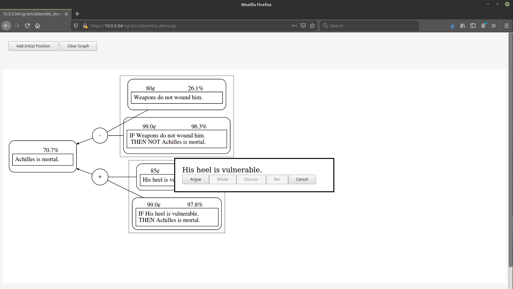

In this step, we click on the position "His heel is vulnerable", which we
will shore up with "pro" evidence.

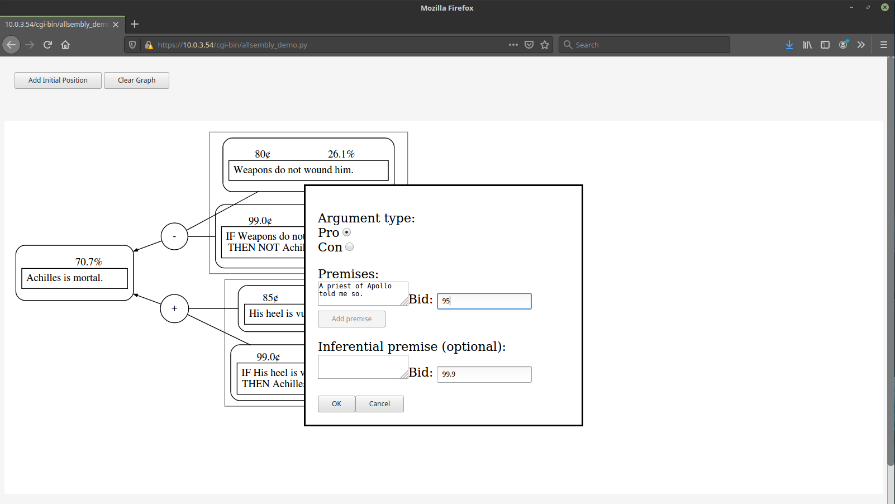

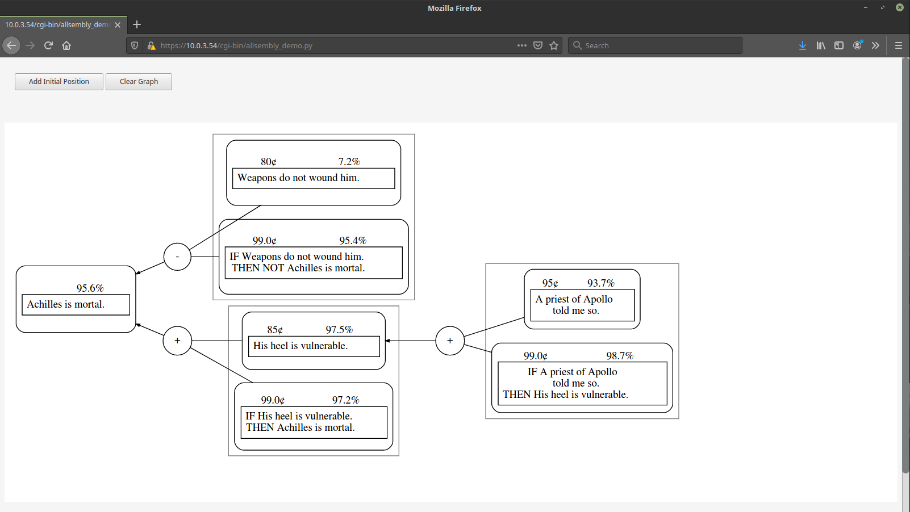

We have the word of a reliable source according to the new "pro" evidence.
There is high confidence in that new position (95 "cents").  The probability
estimate of the position it supports, "His heel is vulnerable", has increased
and so has the probability estimate of the position supported by that position
(i.e., the initial position) that "Achilles is mortal".

*Note that in the current version of the prototype, the software sometimes
requests a new version of the argument graph before it has finished
being drawn.  When that happens, some just added nodes appear to the
far left of the diagram, not connected to the rest of the graph, and
the probabilities might not have been updated.  If that situations occurs, 
you can get the correct latest version of the graph by loading the page again.  
Just press enter in the location line after the URL.  (Do not use the 
browser's reload or refresh button since that would cause the last form
to be resubmitted.)*

Future features
---------------

Decision features
^^^^^^^^^^^^^^^^^

The purpose of the software is decision support, but no features for 
specifically evaluating action or policy options have been added, yet.
Currently, the initial positions are not necessarily of the form:
we should do x (i.e., it would be in the common good to do x).

This section will be updated to include some information about what
the action or policy option evaluation features may look like and
how they might work.

Betting markets and commitment stores
^^^^^^^^^^^^^^^^^^^^^^^^^^^^^^^^^^^^^

Betting markets are not implemented in this version and that is a multi-user
feature. 

A participant's commitment store will consist of their bids and asks and their
betting contracts.  When a participant's commitments are shown to be 
inconsistent that participant will not be able to make other contributions
until the situation is rectified by the sale of one of the betting contracts or
withdrawal of a bid or ask.

The commitment store is currently intended to appear as a separate tab behind
the graph.

There should also be a place to look at market trends and such.  That could
be a third tab.

Random selection of participants
^^^^^^^^^^^^^^^^^^^^^^^^^^^^^^^^

The software currently does not feature selection of participants onto a panel.
Probably, in future versions of the prototype participants will self-select
onto panels, with random selection being an option that can be turned on in
the software.  Self-selection will be easier for testing with small groups
although ultimately we would like to have the software used with large groups
and to avoid self-selection bias.

The selection does not have to be entirely random.  Participants who did 
especially well in previous panels, as measured by how much 'profit' they 
accummulated could have an increased chance of being selected onto a future 
panel.  For example, half of the slots could be filled at random from a pool
of members who have have accumulated better than average profits and the other
half from the whole membership.  This would be to provide an additional 
incentive, but I also suspect that the best distribution for epistemic
success might be more like a normal distribution rather than fully random.  No
participant would ever be locked out of future participation due to poor 
performance.
(The 'profit' accumlated and 'money' that bets are made with will be play 
money so that no participants will be disadvantaged in their ability to 
participate.)

Editing position or argument text
^^^^^^^^^^^^^^^^^^^^^^^^^^^^^^^^^

Positions and arguments will not be able to be edited unless all of those who
have so far placed bets for or against any position in the argument agree.
That is because bettors have to be able to be secure in what they are betting
on.

However, it will be posible to create a new position or argument and have it
associated with the old one(s).  Also, it will be possible to add a gloss
to the text, which must, however, have the same meaning as the text but just
expand on or clarify it.

Alternative layout
------------------
